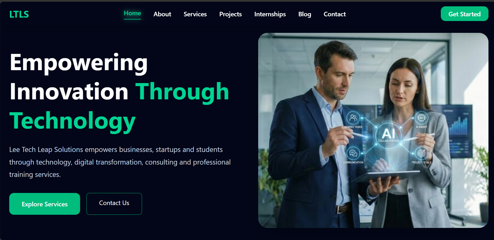
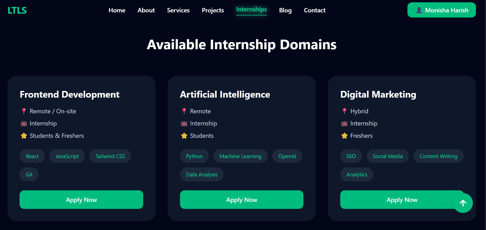
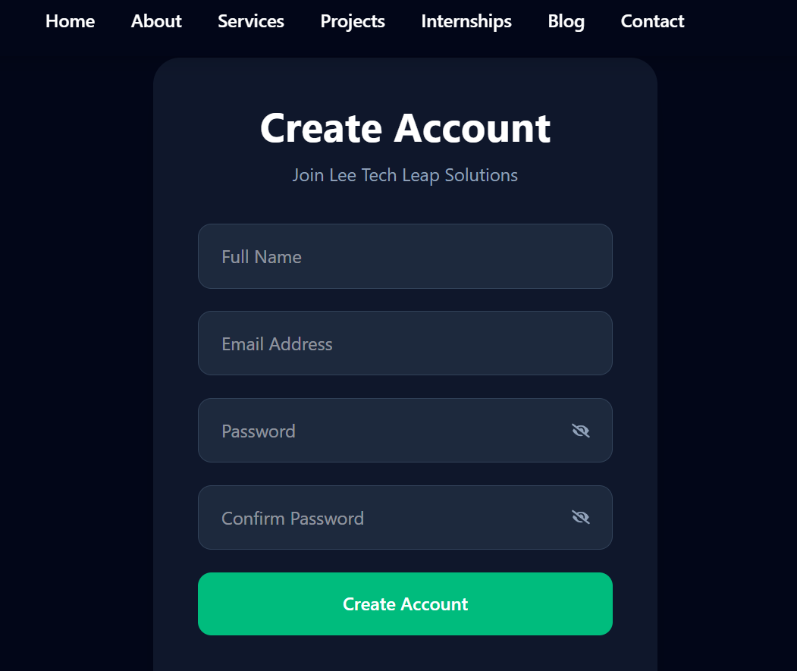

# 🚀 Lee Tech Leap Solutions

> A modern, responsive full-stack company website built using React, Vite, Tailwind CSS, and Firebase.


---

## 📖 About the Project

Lee Tech Leap Solutions is a modern company website developed to provide an interactive digital platform for businesses, students, and professionals.

The website offers secure user authentication, internship applications, blog management, company services, contact management, and an admin dashboard powered by Firebase Cloud Firestore.

This project was developed using modern frontend technologies with a focus on responsive design, user experience, and cloud integration.

---

## ✨ Features

### 👨‍💼 Company Website

- Modern Landing Page
- About Company
- Services Page
- Projects Showcase
- Technology Blog
- Contact Page

### 🔐 Authentication

- User Registration
- Secure Login
- Logout
- Firebase Authentication

### 🎓 Internship Portal

- Browse Internship Opportunities
- Internship Application Form
- Firebase Data Storage
- Duplicate Application Prevention

### 👤 User Dashboard

- User Profile
- Application Management

### 🛠 Admin Dashboard

- Total Users
- Internship Applications
- Contact Messages
- Registered User List
- Dashboard Statistics

### 📱 UI Features

- Fully Responsive Design
- Mobile Navigation
- Active Navbar
- Loading Progress Bar
- Back-to-Top Button
- Smooth Animations
- Modern Dark Theme

---

# 🛠 Tech Stack

## Frontend

- React JS
- Vite
- Tailwind CSS
- React Router DOM
- Framer Motion

## Backend

- Firebase Authentication
- Cloud Firestore

## Deployment

- GitHub
- Vercel

---

# 📸 Project Screenshots

## 🏠 Home Page



---

## 🎓 Internship Portal



---

## 📝 Create Account



---

## 📧 Contact Page


---

# 🔥 Firebase Collections

- users
- internshipApplications
- messages

---

# 🚀 Installation

Clone the repository

```bash
git clone https://github.com/YOUR_USERNAME/lee-tech-leap-solutions.git
```

Move into project

```bash
cd lee-tech-leap-solutions
```

Install dependencies

```bash
npm install
```

Run project

```bash
npm run dev
```

---

# 🌍 Live Demo

🔗 https://lee-tech-leap-solutions.vercel.app/

---

# 👩‍💻 Developed By

**Monisha H**

Computer Science and Engineering Student

Passionate about

- Web Development
- Artificial Intelligence
- Machine Learning
- Cloud Computing

---

# 📫 Connect with Me 

LinkedIn:
https://www.linkedin.com/in/monisha-h

---

# ⭐ If you like this project

Please give this repository a ⭐ on GitHub.

